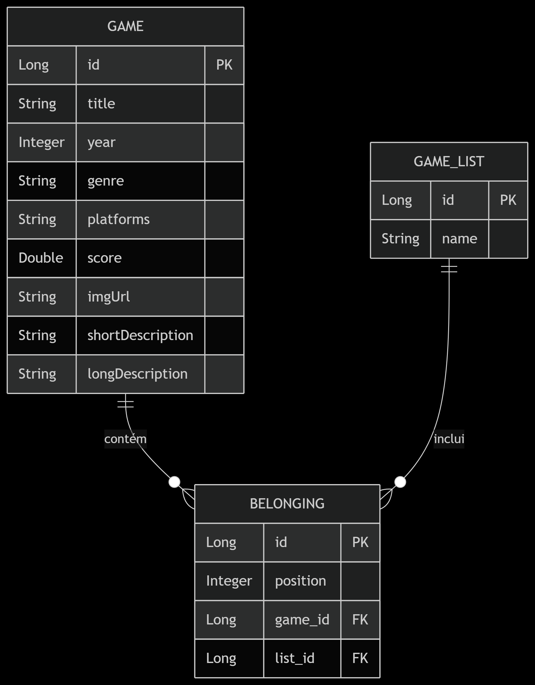

# DSList - API de Catálogo de Jogos 

API RESTful para gerenciar listas de jogos, desenvolvida em SPRING BOOT. Permite criar, organizar e buscar jogos em listas personalizadas.

## Tecnologias
- Backend: Java 21, Spring Boot 
- Banco de Dados: H2 (em memória) / PostgreSQL (produção)
- Ferramentas: Maven, Hibernate
- **Padrões**: REST, DTO, JPA

## Principais Dependências

<dependencies>
     <!-- API Web -->
    <dependency>
        <groupId>org.springframework.boot</groupId>
        <artifactId>spring-boot-starter-web</artifactId>
    </dependency>
    <!-- Persistência -->
    <dependency>
        <groupId>org.springframework.boot</groupId>
        <artifactId>spring-boot-starter-data-jpa</artifactId>
    </dependency>
    <!-- Bancos de Dados -->
    <dependency>
        <groupId>com.h2database</groupId>
        <artifactId>h2</artifactId>
        <scope>runtime</scope>
    </dependency>
    <dependency>
        <groupId>org.postgresql</groupId>
        <artifactId>postgresql</artifactId>
        <scope>runtime</scope>
    </dependency>
</dependencies>

### Ferramentas
- 
## Pré-requisitos
- JDK 17+
- Maven 3.8+
- (Opcional) Docker para PostgreSQL


## Endpoints Principais
Método	Rota ->	Descrição
GET	/games -> Lista todos os jogos
GET	/lists	-> Lista todas as listas
POST	/lists/{listsId}/games	-> Adiciona jogo a uma lista
POST /lists/{listsId}/replacement -> Move jogo da tabela para um index diferente 


# Exemplo de Request (POST /games):

json
```bash 
{
  "title": "The Witcher 3",
  "platform": "PC",
  "genre": "RPG"
}
```
# Diagrama de Entidades 



# Entidades:

GAME: Armazena informações completas sobre jogos

GAME_LIST: Representa listas/coleções de jogos

BELONGING: Tabela de associação (relacionamento N-N entre GAME e GAME_LIST)

# Relacionamentos
Game e GameList possuem uma relação muitos-para-muitos, mediada pela entidade Belonging. Isso permite que um jogo pertença a várias listas e que uma lista contenha vários jogos.

A entidade Belonging também armazena a posição do jogo na lista, permitindo ordenar os jogos dentro de cada lista.
